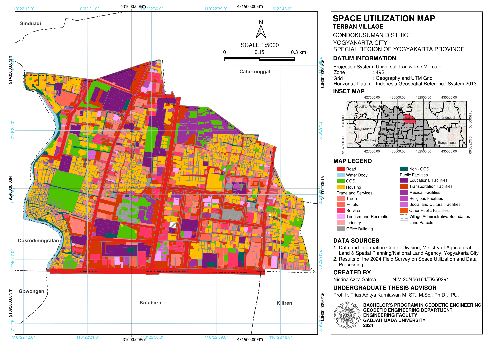
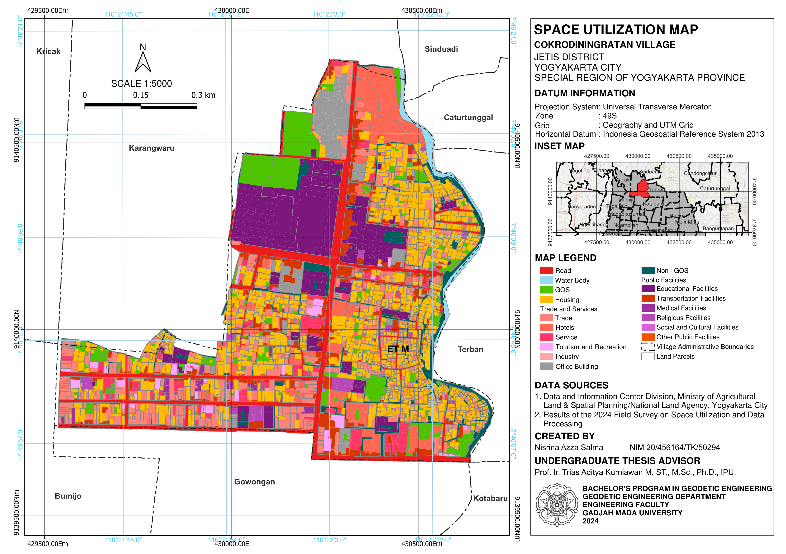

# 🗺️ Space Utilization Suitability Evaluation — Yogyakarta City

> Evaluating the suitability of existing space utilization per land parcel in Terban and Cokrodiningratan Village against the Detailed Spatial Plan (RDTR) of Yogyakarta City using GIS-based spatial analysis.

---

## 📌 Project Overview

Urban spatial plans are only effective when existing space utilization aligns with the intended planning. This project evaluates the **degree of suitability and unsuitability** between actual space utilization and the zoning regulations stipulated in Yogyakarta's **Rencana Detail Tata Ruang (RDTR)** — Indonesia's binding detailed spatial plan at the city level.

The analysis identifies areas of unsuitability based on the ITB(TB)X provision matrix, quantifies their spatial extent by administrative unit, and produces thematic maps for planning and policy use.

---

## 🎯 Research Objectives

- Identify the distribution of existing space utilization activities across the study area
- Evaluate spatial suitability between existing space utilization per land parcel and RDTR zoning designations
- Quantify the extent of suitable (permitted (I), limited permitted (T), conditionally permitted (B), limited and conditionally permitted (TB)) vs. unsuitable (not permitted (X)) land parcels
- Produce thematic maps suitable for spatial governance recommendations

---

## 🔍 Key Findings

- Housing activities dominate Cokrodiningratan Village with a clustered spatial distribution pattern on most freehold
parcels.
- Public service facilities activities dominate Terban Village with a random spatial distribution pattern on most freehold parcels.
- Space utilization activities that are not permitted due to their unsuitability with the plan in Cokrodiningratan Village account for 0.35% of the village area, while in Terban Village, they account for 1.42% of the village area.
- The percentage of space utilization activities indicated as permitted with restrictions or conditionally in Cokrodiningratan Village is higher than in Terban Village.
- Findings suggest a need for controlling and adjusting the perpetrators of unsuitability.
- Differences exist in the data sources for administrative boundaries, roadways, and waterways used by the Ministry of Agrarian Affairs and Spatial Planning/National Land Agency (ATR/BPN) of Yogyakarta City in its land parcel records and by the Yogyakarta City Land and Spatial Planning Agency in the 2021–2041 Yogyakarta City RDTR Map.

---

## 🛠️ Tools & Technologies

| Tool | Purpose |
|------|---------|
| QGIS 3.28 | Spatial overlay, Spatial join and attribute processing, Model Builder automation, map production |
| Microsoft Excel | Tabular summarisation and suitability calculations |

---

## ⚙️ Methodology

### 1. Data Preparation
- Obtained the land parcel layer from Yogyakarta City Data and Information Center of the Ministry of Agrarian Affairs and Spatial Planning/Agency National Land Affairs (ATR/BPN)
- Acquired existing space utilization per land parcels polygon layer from field survey
- Obtained RDTR zoning layer from Yogyakarta City Land and Spatial Planning Agency
- Reprojected all layers to a consistent CRS: **Indonesian Geospatial Reference System 2013 (EPSG:9468)**
- Standardised attribute fields and cleaned topology errors

### 2. Automated Workflow — QGIS Model Builder

The core analysis was automated using **QGIS Graphical Modeler (Model Builder)**, eliminating manual repetition and ensuring a reproducible, step-by-step workflow.

The model performs the following steps in sequence:

```
[Input: Existing Space Utilization] ──┐
                                      ├──► Join Attributes by Layer
[Input: RDTR Layer] ───────────┘        │
                                               │
                                               ▼
                                Assign Suitability Classification
              (permitted (I), limited permitted (T), conditionally permitted (B),
           limited and conditionally permitted (TB)) vs. unsuitable (not permitted)
                                               │
                                               ▼
                              Calculate Geometry (Area in square meters)
                                               │
                                               ▼
                             Symbolizing based on the RDTR standard
                                               │
                                               ▼
                             [Output: Suitability Evaluation Layer]
```

> The `.model3` file is included in this repository — see `model/suitability_eval.model3`

### 3. Suitability Classification Logic

Each intersected feature was classified based on whether its space utilization matched the RDTR zone designation:

| Class | Definition |
|---|---|
| ✅ Permitted (I) | Permitted space utilization activities, refer to suitability and directions for area functions in the RDTR Map |
| ⚠️ Limited Permitted (T) |  Limited permitted space utilization activities, refer to minimum building standards, operating restrictions, or regulations, other additions |
| ⚠️ Conditionally Permitted (B) | Space utilization activities that are permitted conditionally or with a conditional use permit |
| ⚠️ Limited and Conditionally Permitted (TB) | Space utilization activities that are permitted on a limited and conditional basis, certain |
| ❌ Not-Permitted (X) | Space utilization activities that are not permitted, due to their nature and role. If the plan is not in accordance with the plan that has been prepared, it can have a big impact on the surrounding environment. |

> ⚠️ **Roadways and Waterways are not included** in this repository, due to the differences in source data used by the Ministry of Agrarian Affairs and Spatial Planning/National Land Agency (ATR/BPN) of Yogyakarta City in its land parcel records and by the Yogyakarta City Land and Spatial Planning Agency in the 2021–2041 Yogyakarta City RDTR Map.

### 4. Area Calculation & Summary Statistics
- Area computed using QGIS geometry tools (in square meters)
- Results summarised by administrative unit (kelurahan)
- Final statistics exported to Excel for reporting

### 5. Cartographic Output
- Thematic maps produced following SNI cartographic standards
- Final maps exported at 1:5,000 scale

---

## 🗺️ Maps

### Existing Land Use



### RDTR Zoning Designation

> source: Yogyakarta Mayor’s Regulation Number 118 of 2021 page 105

### Suitability Evaluation Result


---

## 📊 Results Summary

## Terban Village
| Conformity Class | Area (m^2) | Percentage (%) |
|---|---|---|
| Permitted (I) | 438,482 | 62.43 |
| Limited Permitted (T) | 51,416 | 7.32 |
| Conditionally Permitted (B) | 199,208 | 28.36 |
| Limited and Conditionally Permitted (TB) | 3,323 | 0.47 |
| Not Permitted (X) | 9,965 | 1.42 |
| **Total** | **702,394** | **100%** |

## Cokrodiningratan Village
| Conformity Class | Area (m^2) | Percentage (%) |
|---|---|---|
| Permitted (I) | 399,534 | 68.63 |
| Limited Permitted (T) | 66,945 | 11.50 |
| Conditionally Permitted (B) | 112,214 | 19.27 |
| Limited and Conditionally Permitted (TB) | 1,456 | 0.25 |
| Not Permitted (X) | 2,033 | 0.35 |
| **Total** | **582,182** | **100%** |
---

## 📂 Repository Structure

```
📁 map/
   ├── terban_space_utilization_existing.png
   ├── cokro_space_utilization_existing.png
   ├── rdtr_zoning.png
   ├── terban__suitability_eval.png
   └── cokro__suitability_eval.png


📁 model/
   └── suitability_eval.model3   ← QGIS Model Builder file

README.md
```

> ⚠️ **Raw data is not included** in this repository. Source datasets are subject to licensing restrictions from local government authorities. The workflow model and maps are shared for transparency and as a reference for reproducibility.

---

## 📚 Data Sources

- **Existing Space Utilization:** Field Survey
- **Land Parcel Layer:** Data and Information Center of the Ministry of Agrarian Affairs and Spatial Planning/Agency National Land Affairs (ATR/BPN) Yogyakarta City
- **RDTR Zoning Layer:** Yogyakarta City Land and Spatial Planning Agency
- **Administrative Boundaries:** Yogyakarta City Geoportal
- **Basemap:** Yogyakarta City Land and Spatial Planning Agency
- **Regulation Cited:** Yogyakarta Mayor’s Regulation Number 118 of 2021

---

## 👩‍💻 Author

**Nisrina Azza Salma**
Geodesy & Geomatics Engineering — Universitas Gadjah Mada (2025)

[](https://linkedin.com/in/nisrina-azza-salma-3b11561bb/)
[](https://github.com/Nisrina03Azza)

---

## 📄 License

Methodology and model file: MIT License.
Map outputs derived from government sources carry their respective usage terms.

---

*Undergraduate thesis project — Universitas Gadjah Mada, 2025. Feedback welcome via Issues.*
